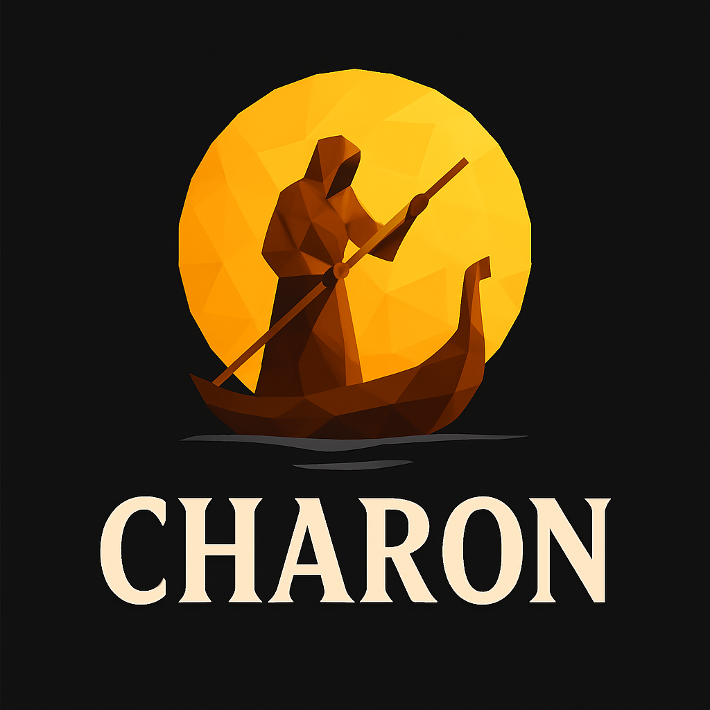

<div align="center">
  
  <h1>Charon Game Engine</h1>
  <p><strong>A modern, modular 2D game engine built with C# and .NET 9.0</strong></p>

  [](https://dotnet.microsoft.com/)
  [](https://docs.microsoft.com/en-us/dotnet/csharp/)
  [](https://opensource.org/licenses/MIT)
</div>

---

## 🎮 Overview

Charon is a cross-platform 2D game engine designed with **modularity** and **extensibility** at its core. Built on modern .NET with SDL3 for hardware-accelerated graphics, it provides a clean, intuitive API for creating high-performance 2D games.

Whether you're building a platformer, top-down adventure, or experimental game prototype, Charon gives you the tools you need without getting in your way.

## ✨ Key Features

### 🏗️ Modular Architecture
- **Pluggable Backends**: Swap rendering backends (SDL3, SDL3-GPU, Vulkan, DirectX) without changing your game code
- **Module System**: Organize features into reusable, self-contained modules
- **Dependency Injection**: Built on Autofac with automatic service discovery and lifecycle management
- **Clean Abstractions**: Interfaces separate contracts from implementations

### 🎨 Advanced Rendering
- **Hardware-Accelerated**: SDL3 integration with OpenGL and Vulkan support
- **Flexible Batching**: `RenderBatch` for immediate-mode rendering, `SpriteBatch` for optimized sprite drawing
- **Shape Rendering**: Points, lines, convex polygons with automatic triangulation
- **Matrix Transformations**: Full 2D transformation support (translation, rotation, scale, skew)
- **Blend Modes**: Customizable source and destination blend modes

### 🧩 Entity Component System (ECS)
- **Live Queries**: Observer-pattern queries that automatically update when components change
- **Type-Safe Components**: All components implement `IComponent` interface
- **Efficient Storage**: SparseSet-based storage for O(1) component access
- **Fluent Query Builder**: Intuitive query syntax with `All<T>()`, `One<T>()`, `Exclude<T>()`

### 🎨 Font Rendering
- **Multiple Formats**: Support for BDF (Bitmap Distribution Format) and BMF (Bitmap Font) formats
- **Custom Font Pipeline**: Extensible font loading system via content pipeline
- **Debug Overlay**: Built-in debug text rendering with customizable fonts

### 🎯 Content Pipeline
- **Asset Management**: Centralized content loading with `IContentManager`
- **Extensible Loaders**: Register custom loaders for any file format
- **Type-Safe API**: Generic loading methods with compile-time type checking

### 🛠️ Developer Experience
- **Scene System**: Organize game logic into scenes with automatic dependency injection
- **Configuration System**: Comprehensive options pattern for engine and module settings
- **Debug Tools**: Built-in FPS counter, debug overlay, and logging
- **Hot Reload**: Leverage .NET's hot reload capabilities for rapid iteration

## 🚀 Quick Start

### Installation

```bash
dotnet new console -n MyGame
cd MyGame
dotnet add package Abyzz.Charon.Core
dotnet add package Abyzz.Charon.Backend.Sdl3
```

### Basic Game

```csharp
using Charon;
using Charon.Sdl3;

var game = new CharonGameBuilder()
    .ConfigureLogging(logging => logging.AddConsole())
    .UseMainScene<MyGameScene>()
    .UseSdl3()
    .Build<MyGameModule>();

game.Initialize();
game.Run();
```

### Creating a Module

```csharp
using Abyzz.Charon;

[DependsOn(
    typeof(CharonDebugModule)
)]
public class MyGameModule : CharonModule
{
    public override void PreConfigureServices(IServiceCollection services)
    {
        ConfigureContentPipeline(services);
        ConfigureSdl3();
    }

    private void ConfigureContentPipeline(IServiceCollection services)
    {
        services.AddFileSystemContentPipeline(c => c.RootPath = "./content");
    }
    
    private void ConfigureSdl3()
    {
        Configure<Sdl3Settings>(c =>
        {
            c.Title = "My Game";
            c.IsResizable = true;
            c.LimitFps = true;
            c.TargetFps = 60;
            c.WindowWidth = 1024;
            c.WindowHeight = 768;
        });
    }
}
```

### Creating a Scene

```csharp
using Charon;

public class MyGameScene : IScene
{
    private IRenderBatch _batch;

    public required IKeyboardInputService Keyboard { private get; init; }
    public required ICharonGame Game { private get; init; }
    public required Func<IRenderBatch> RenderBatchFactory { private get; init; }

    public void Initialize()
    {
        _batch = RenderBatchFactory();
    }

    public void Update(IGameTime gameTime)
    {
        if (Keyboard.IsKeyDown(Keys.KeyEscape))
            Game.Shutdown();
    }

    public void Render()
    {
        using (_batch.Begin())
        {
            _batch.FillShape(
                new Rectangle(100, 100, 200, 150),
                Color.CornflowerBlue
            );
        }
    }

    public void Dispose() { }
}
```

### Using the ECS

```csharp
using Charon.Ecs;

public struct TransformComponent : IComponent
{
    public Vector2 Position;
    public float Rotation;
    public Vector2 Scale;
}

public struct VelocityComponent : IComponent
{
    public Vector2 Velocity;
}

// In your scene:
public void Initialize()
{
    var entity = _entityManager.CreateEntity();
    _entityManager.Add(entity, new TransformComponent
    {
        Position = new Vector2(100, 100),
        Scale = Vector2.One
    });
    _entityManager.Add(entity, new VelocityComponent
    {
        Velocity = new Vector2(2, 0)
    });

    // Create a query that auto-updates
    _movementQuery = _queryBuilder
        .All<TransformComponent>()
        .All<VelocityComponent>()
        .Build();
}

public void Update(IGameTime gameTime)
{
    // Query stays current automatically via observer pattern
    foreach (var entity in _movementQuery)
    {
        ref var transform = ref _entityManager.GetComponent<TransformComponent>(entity);
        ref var velocity = ref _entityManager.GetComponent<VelocityComponent>(entity);

        transform.Position += velocity.Velocity * gameTime.DeltaTime;
    }
}
```

## 📦 Project Structure

```
Charon Game Engine
├── src/
│   ├── Abyzz.Charon/                    # Core engine (game loop, services)
│   ├── Abyzz.Charon.Shared/             # Shared types and abstractions
│   ├── Abyzz.Charon.Modularity/         # Module system & DI
│   ├── Abyzz.Charon.Backend.Sdl3/       # SDL3 rendering backend
│   ├── Abyzz.Charon.Backend.Sdl3.Image/ # SDL3_image integration
│   ├── Abyzz.Charon.Ecs/                # Entity Component System
│   ├── Abyzz.Charon.Ecs.Abstractions/   # ECS interfaces
│   ├── Abyzz.Charon.Font/               # Font rendering abstractions
│   ├── Abyzz.Charon.Font.Bdf/           # BDF font loader
│   ├── Abyzz.Charon.Font.Bmf/           # BMF font loader
│   ├── Abyzz.Charon.Debug/              # Debug overlay & tools
│   ├── Abyzz.Bdf/                       # BDF parser library
│   └── Abyzz.Extensions/                # Utility extensions
├── app/
│   └── Abyzz.Charon.Demo/               # Demo application
└── tools/
    └── Abyzz.Charon.ToolSet/            # Development tools
```

## 🎯 Core Concepts

### Modular Backend System

Charon's rendering backend is completely swappable:

```csharp
// Use SDL3 with OpenGL/Vulkan
game.UseSdl3();

// Future: Use SDL3-GPU for modern graphics API
game.UseSdl3Gpu();

// Future: Use pure Vulkan backend
game.UseVulkan();
```

All rendering code remains unchanged—the abstraction layer handles the rest.

### Live ECS Queries

Unlike traditional ECS systems that rebuild queries each frame, Charon uses an **observer pattern** to keep queries current:

```csharp
// Query is built once
var enemiesQuery = queryBuilder
    .All<TransformComponent>()
    .All<EnemyComponent>()
    .Exclude<DeadComponent>()
    .Build();

// Component changes automatically update the query
entityManager.Add(entity, new DeadComponent());
// ↑ Entity automatically removed from enemiesQuery

// No manual refresh needed—query is always current!
foreach (var enemy in enemiesQuery) { ... }
```

### Service Lifecycle

Services can be scoped, singleton, or transient:

```csharp
[ExposeServices(typeof(IMyService))]
public class MyService : IMyService, ISingletonDependency
{
    // Automatically registered as singleton
}
```

## 🔮 Future Plans

### Core Engine
- [ ] **Scene Transitions**: Fade, slide, and custom transition effects
- [ ] **Asset Hot Reload**: Reload textures, fonts, and assets at runtime
- [ ] **Performance Profiler**: Built-in profiling tools for CPU/GPU metrics
- [ ] **Entity Pooling**: Object pooling for high-frequency entity creation/destruction

### ECS Enhancements
- [ ] **Generational Indices**: Prevent use-after-free bugs with entity versioning
- [ ] **Archetype System**: Optional high-performance backend for 10k+ entities
- [ ] **Component Events**: Fine-grained `OnComponentAdded`/`OnComponentRemoved` events
- [ ] **Query Caching**: Further optimize query performance for complex scenes

### Physics
- [ ] **Abyzz.Charon.Physics**: Physics abstraction layer
- [ ] **Abyzz.Charon.Physics.Box2D**: Box2D C# integration
- [ ] **Abyzz.Charon.Physics.Simple**: Simple AABB/circle collision for prototyping

### Audio
- [ ] **Abyzz.Charon.Audio**: Audio abstraction layer
- [ ] **Abyzz.Charon.Audio.Sdl3Mixer**: SDL3_mixer backend
- [ ] **Abyzz.Charon.Audio.OpenAL**: OpenAL backend for 3D spatial audio

### Rendering
- [ ] **Abyzz.Charon.Backend.Sdl3Gpu**: SDL_GPU backend (Metal/Vulkan/DX12)
- [ ] **Abyzz.Charon.Backend.Vulkan**: Direct Vulkan backend
- [ ] **Particle System**: Flexible, ECS-integrated particle effects
- [ ] **Post-Processing**: Shader-based post-processing pipeline
- [ ] **Lighting System**: 2D lighting with shadows and normal maps

### Animation
- [ ] **Abyzz.Charon.Animation.Sprite**: Frame-based sprite animation
- [ ] **Abyzz.Charon.Animation.Tweening**: Easing functions for smooth interpolation
- [ ] **Skeletal Animation**: Bone-based 2D animation system

### Utilities
- [ ] **Tilemap Support**: Tiled map editor integration
- [ ] **Spritesheet Packer**: Automatic texture atlas generation
- [ ] **Level Editor**: In-engine level editing tools
- [ ] **ImGui Integration**: Immediate-mode GUI for tools and debugging

### Platforms
- [ ] **Mobile**: iOS and Android support
- [ ] **Web**: WebAssembly/Blazor experimental support
- [ ] **Console**: Nintendo Switch, Xbox, PlayStation (via certified SDKs)

## 🛠️ Requirements

- **.NET 9.0** or later
- **SDL3** runtime libraries (managed via NuGet)
- **Graphics drivers** with OpenGL 3.3+ or Vulkan support

## 💻 Supported Platforms

| Platform | x64 | ARM64 |
|----------|-----|-------|
| Windows 10/11 | ✅ | ✅ |
| Linux | ✅ | ✅ |
| macOS | ✅ | ✅ |

## 🤝 Contributing

Contributions are welcome! Whether you're:
- 🐛 Fixing bugs
- ✨ Adding features
- 📚 Improving documentation
- 🎨 Creating examples

Please feel free to open issues and pull requests.

## 📄 License

This project is licensed under the **MIT License**. See the [LICENSE](LICENSE.md) file for details.

## 🙏 Acknowledgments

- **SDL3 Team** — For the outstanding multimedia library
- **.NET Team** — For the modern runtime and language features
- **Autofac Team** — For the flexible dependency injection container
- **Game Dev Community** — For inspiration and knowledge sharing

---

<div align="center">
  <strong>Built with ❤️ for game developers who value modularity and clean code</strong>
</div>
